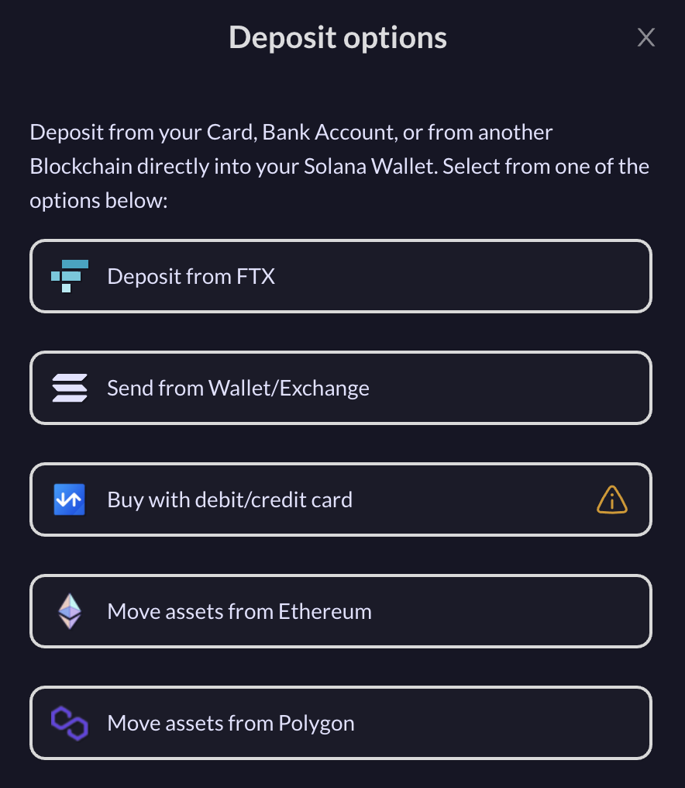

# Dépôts

### Dépôts

Utiliser MeanFi pour déposer votre argent fiat dans MeanFi est simple et direct. Vous pouvez effectuer des dépôts en utilisant votre carte de crédit/débit, vos comptes bancaires (SEPA), ou à partir d'une autre blockchain (comme Ethereum ou Polygon) directement dans votre portefeuille Solana.

Toutes ces options seront disponibles via l'élément de menu > \*\*Dépôts. \*\*

Vous trouverez ci-dessous les étapes à suivre pour effectuer des dépôts dans votre portefeuille en utilisant différentes options de chargement.


Pour être sûr d'avoir toutes les options disponibles, vous devez d'abord connecter votre **Solana Wallet**. Il est nécessaire pour les options de la rampe d'accès.


#### Dépôt de FTX

1. **Sélectionnez** l'option > **Dépôt à partir de FTX**
2. Si vous avez déjà un compte chez FTX, vous serez invité à vous connecter, puis à entrer le montant que vous souhaitez transférer dans votre portefeuille.
3. Si vous n'avez pas de compte sur FTX, vous pourrez en créer un ici même.
4. Une fois que FTX a approuvé vos fonds, vous les verrez disponibles dans votre portefeuille. FTX prend généralement quelques minutes pour approuver votre transaction. Pour en savoir plus sur FTX, cliquez [ici.](https://ftx.com/en)

#### Envoyer depuis le portefeuille / l'échange

1. \*\*Sélectionnez \*\*option > **Envoyer depuis un portefeuille / un échange**
2. Vous serez invité à indiquer l'adresse du compte, ainsi qu'un code QR à scanner facilement depuis un autre portefeuille pour effectuer un dépôt dans votre portefeuille \*\*Solana. \*\*

#### Déplacer des actifs depuis Ethereum ou Polygon

1. \*\*Sélectionnez \*\*une des options : **Déplacer les actifs d'Etherium / Polygon**
2. Vous serez alors connecté à [AllBridge](https://app.allbridge.io), un pont qui vous permet de déplacer des actifs entre les blockchains. Par exemple : déplacer des actifs d'Ethereum vers Solana.
3. La passerelle vous guidera dans les étapes à suivre pour réussir le transfert de vos biens. \_Pour en savoir plus sur Allbridge, cliquez [ici](https://allbridge.io). \_

### \*\*\*\*
